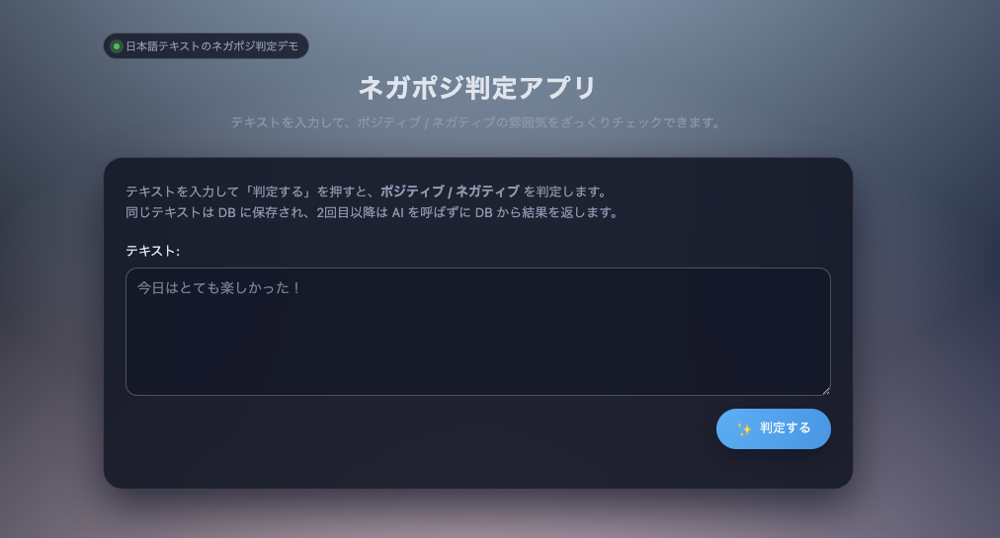
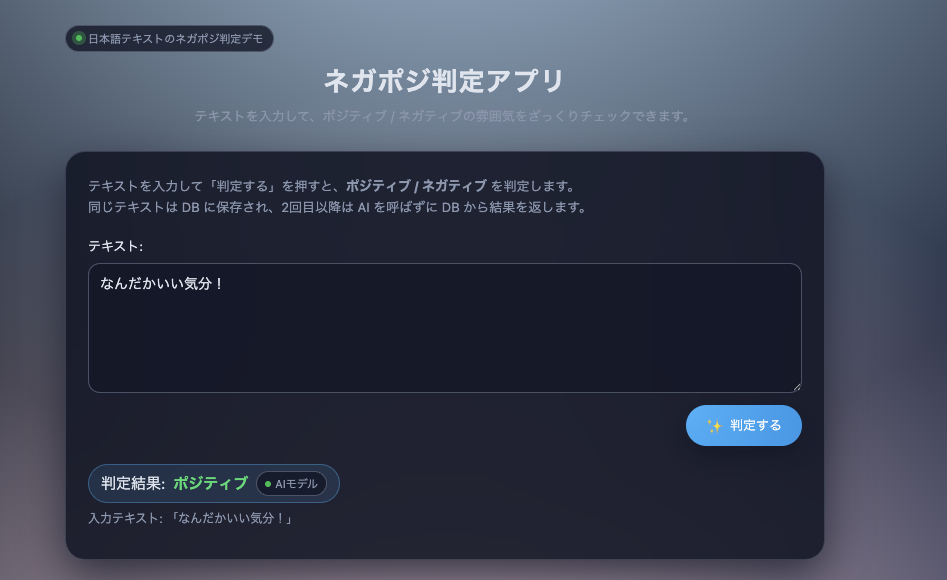

# 設計書
## フロント

概要：入力されたテキストをバックエンドに送り、返ってきた結果を表示する。
1. フォームにテキストが入力される。
2. 「判定する」ボタン押下後、リクエストをバックエンドに送る。
3. レスポンスが返ってくるまでボタンが「判定中」に切り替わり、非活性になる。
4. レスポンスが返ってきたら、判定結果を表示。
    - DBキャッシュかAI推論かも表示。
    - 入力テキストも表示。

## バックエンド
概要：画面からのリクエストを受け取り、DBキャッシュしつつ、APIを呼び出し、結果を返す。
1. 画面からリクエストを受け取る。
2. 受け取ったリクエストが持つテキストがDB（`sentiments.db`）に存在するかチェック。
    - 存在するならDBからそのテキストに対する`label`を取得。
    - 存在しないなら、感情分析APIを呼び出し、`label`を含むレスポンスを受け取り、DBに`insert`する。
4. レスポンスを画面に返す。

## 感情分析API
概要：バックエンドから送られてきたテキストをAIモデルに入力し、その出力ラベルを返す。
1. バックエンドからリクエストを受けt流。
2. 受け取ったリクエストが持つテキストをAIモデルに入力する。
3. AIモデルの出力を含むレスポンスをバックエンドに返す。